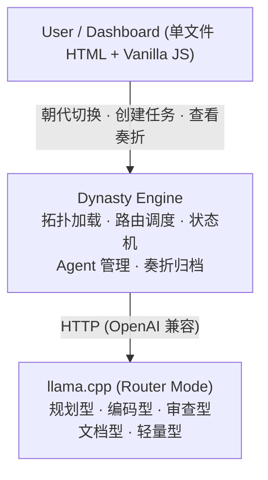

# ZhenguanEdict

**历代官制 × 闭环自动化 × 多 Agent 协作框架**

将中国历代治理智慧的演进，映射为多智能体协作的拓扑模式。从炎黄部落的二人分工到清代军机处的极速闭环——每个朝代代表一种 Agent 协作范式。

---

## 核心理念

单个 LLM Agent 不可靠，但**制度化的协作系统**可以可靠。

中国古代官制用了一千多年解决一个核心问题：如何让一群各有私心的人协同产出稳定的治理结果。答案是——**分权制衡、专职审核、完整留痕**。这套思路放在多 Agent 系统中，比 CrewAI、AutoGen 等现代框架更早洞见了"制度性审核"的必要性。

ZhenguanEdict 不是模仿 Edict 做一个朝代，而是把**整个官制进化史**做成一幅可交互的拓扑图谱。

---

## 朝代速览

| 时期 | Agent数 | 协作模式                | 对应循环模式              | 核心创新       | 适用场景 |
|------|---------|-------------------------|---------------------------|----------------|----------|
| 炎黄 | 2       | 部落联盟，二人分工      | 基础单 Agent 循环          | 角色分化雏形   | 个人原型、单任务、无需协调 |
| 夏   | 3       | 王权 + 神权 + 工权      | 占卜即 QA                 | 最早的审查节点 | 首个质量关卡、单审批节点 |
| 商   | 4       | 神权主导，贞人代天言事  | Maker-Checker-Logger      | 审计日志起源   | 审计留痕、验证执行分离 |
| 周   | 5+      | 封建分权，诸侯自治      | Worktree 并行沙箱         | 隔离执行       | 多模块并行开发、微服务隔离 |
| 秦   | 6       | 法治集权，绝对路由      | 确定性流水线              | 硬编码路由     | 标准化流水线、零自由裁量 |
| 汉   | 12      | 三公九卿，互相制衡      | 多路验证                  | 三权分立       | 多维并行评审、三权分立治理 |
| 隋唐 | 12      | 三省六部，封驳制度      | 完整审核闭环              | 代际性审核     | 完整评审闭环、专职 Reviewer 分离 |
| 宋   | 14+     | 权力分散，多重验证      | 多路并行验证              | Agent 冗余     | 高可靠冗余验证、分歧升级仲裁 |
| 明   | 10+     | 内阁预审 + 司礼监批红   | 快捷通道 + 隐藏审查       | 双轨制         | 双轨发布、影子验证层 |
| 清   | 8+      | 军机处极速决策          | 双速闭环                  | 紧急通道       | 双速运维、优先级分级调度 |

---

## 架构示意



---

## 快速启动（后续实现）

```bash
# 前置：安装 llama.cpp，准备 GGUF 模型
# 启动模型服务
llama-server --models-dir ./models --models-max 4 -c 8192 -ngl 99

# 启动调度引擎
python engine/server.py
```

---

## 设计文档

| 文档                                         | 说明                                              |
|----------------------------------------------|---------------------------------------------------|
| `docs/Architecture-Design-架构设计.md`       | 整体架构、三层设计、运行时切换、模型类型定义      |
| `docs/Dynasty-Topology-朝代拓扑.md`          | 10 个朝代的 Agent 拓扑、角色定义、权限矩阵        |
| `docs/Builtin-Loops-内建循环.md`             | 内建循环、古代制度映射、实现策略                  |

---

## License

MIT
