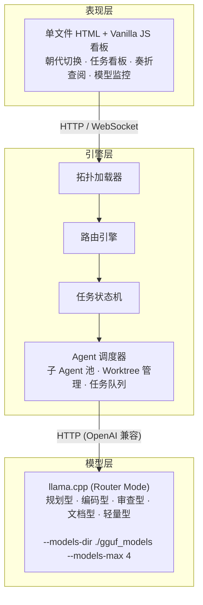
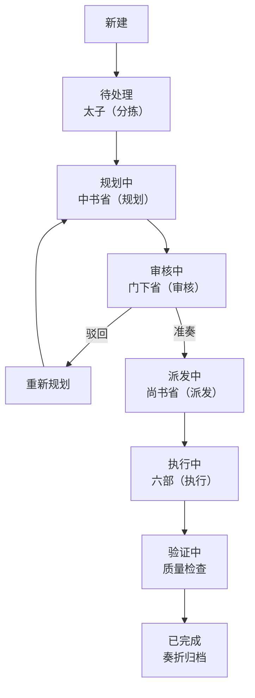

# 架构设计

## 项目定位

ZhenguanEdict 是一个将中国历代治理智慧的演进映射为多智能体协作拓扑的实验性框架。每一个朝代代表一种独特的 Agent 组织方式、通信规则和决策流转模式。

与大多数固定一种协作模式的多智能体框架不同，ZhenguanEdict 支持**运行时动态切换**协作模式——让用户可以观察和比较不同治理模型对任务执行效率、质量和成本的影响。

---

## 三层架构



### 表现层

看板是一个**单文件 HTML**，使用 Vanilla JavaScript 和 CSS。无构建步骤、无包管理器、无框架依赖。通过 HTTP REST 调用与引擎层通信。

核心视图：

- **旨意看板** — 按状态列展示任务，可按朝代和部门筛选
- **朝代切换** — 一键切换治理拓扑
- **奏折阁** — 已完成任务的完整时间线记录
- **官员总览** — Token 消耗、Agent 健康状态、模型状态

### 引擎层

核心 Python 服务，包含四个组件：

**拓扑加载器**：从结构化定义（Python dict 或 YAML）加载朝代的完整配置——Agent 角色、通信矩阵、状态机规则。用户切换朝代时，拓扑加载器热加载新配置，无需重启服务。

**路由引擎**：执行当前朝代的权限矩阵定义的通信规则。决定哪些 Agent 可以和谁通信、允许什么消息类型、消息是否需要审批后才能转发。

**任务状态机**：管理每个任务在 9 个状态间的生命周期流转：

```
新建 → 待处理 → 规划中 → 审核中 → (驳回 → 重新规划 → 审核中)
        → 派发中 → 执行中 → 验证中 → 已完成
```

状态机是朝代感知的：有些朝代跳过审核（炎黄），有些增加多重审核（宋）。

**Agent 调度器**：管理实际执行——将任务分配到模型实例、为并行执行创建 Worktree、管理队列积压、处理重试和失败。

### 模型层

基于 **llama.cpp** 的 Router Mode 运行。这允许在单个 OpenAI 兼容的 API 端点后加载多个 GGUF 模型。路由器根据请求中的 `model` 字段将每个请求分发到相应模型。

---

## 运行时朝代切换

运行时切换朝代是此项目的核心差异化特性。

### 切换流程

1. 用户从看板选择新朝代
2. 拓扑加载器读取新朝代的定义（`topologies/suitang.py`、`topologies/song.py` 等）
3. Agent 调度器按需创建/移除 Agent 实例
4. 看板刷新以显示新的组织架构
5. 所有历史任务数据（奏折）在切换中保留

### 在飞任务处理策略

**已提交的任务**：所有未完成任务保留其**原朝代**的路由规则和状态机，直到完成或被取消。在飞任务不会被强制迁移到新朝代的拓扑。

**新提交的任务**：使用新朝代的路由规则、状态机和角色映射。

**示例**：从隋唐切换到炎黄时，一个正在"审核中"状态的隋唐任务仍由门下省完成审核；同时新创建的炎黄任务走简化流程（待处理→执行中→已完成）。

### 代理不可用与错误处理

当代理或模型服务出现故障时，系统按以下策略处理：

| 场景 | 处理方式 |
|---|---|
| **LLM 调用超时** | 指数退避重试（1s → 2s → 4s），最多 3 次。3 次均超时则任务进入 REJECTED 状态并记录失败原因 |
| **模型加载失败** | 标记对应代理为不可用，尝试使用同类型的降级模型。若降级模型也不可用，任务暂停等待恢复 |
| **审核代理崩溃** | 任务在当前状态等待，60 秒后自动重试。超过 3 次失败则标记 REJECTED |
| **用户主动中止** | 支持通过看板或 API 将任何非终态任务设为 CANCELLED |
| **王朝切换时角色缺失** | 在飞任务保留原角色，不因新朝代缺少对应角色而受影响 |

> **注**：上述默认参数（重试 3 次、退避间隔、超时 60s）在引擎配置中可调整。

---

## 模型类型定义

按能力需求定义五种模型类型，不绑定具体模型名称：

| 模型类型    | 预期能力            | 典型角色        |
| ------- | --------------- | ----------- |
| **规划型** | 强推理、任务拆解、长上下文支持 | 中书省、内阁      |
| **编码型** | 代码生成、调试、技术实现    | 兵部、工部       |
| **审查型** | 批判性分析、安全审计、错误检测 | 门下省、刑部、御史   |
| **文档型** | 结构化写作、文档编写、报告生成 | 礼部、户部（报表）   |
| **轻量型** | 快速响应、分类、路由      | 太子、诸侯（简单任务） |

每个朝代将这些类型映射到具体角色。同一物理模型可为多种类型服务，不同类型也可在资源受限环境下共享同一物理模型。

---

## 任务状态机

引擎层定义的通用状态流转（`新建 → 待处理 → 规划中 → 审核中 → 重新规划 ↺ 规划中 → 派发中 → 执行中 → 验证中 → 已完成`）是各朝代状态机的基础模板。每个朝代在此基础上简化或扩展特定环节。

此外定义两个终态：**已驳回（REJECTED）**——审核多次不通过或超时后的强制终止；**已取消（CANCELLED）**——用户主动中止。这两个终态可从任何非终态状态进入。

共 11 个状态（9 个流转态 + 2 个终态）。

### 标准参考（唐代）



### 各朝代变体

| 朝代 | 相对于标准模板的差异 |
|---|---|
| **炎黄** | 大幅简化：跳过规划、审核、验证三个阶段。`待处理 → 执行中 → 已完成` |
| **夏** | 增加占卜审批关卡：检查者（祭司）占卜不吉（凶）驳回至制定者重新规划。`制定 → 检查（占卜）↺ 制定` |
| **商** | 验证节点后新增记录分支：检查者（贞人）验证后同时触发执行者（工正）和记录者（史官）归档 |
| **周** | 派发后拆分为多个并行执行节点（诸侯），全部完成后汇总 |
| **秦** | 无驳回循环：按规则路由后顺序执行→验证，不做迭代。监控者（御史）只读监控，无驳回权 |
| **汉** | 规划后开启三路并行校审（三公：丞相/太尉/御史大夫），汇总后派发至执行层（九卿） |
| **隋唐** | 标准参考（上图）：完整的制定者-检查者闭环，检查者（门下省）拥有封驳驳回权 |
| **宋** | 三重并行审核（中书门下/枢密院/三司使），意见不一致时升级裁决 |
| **明** | 双轨审批：正式通道（内阁票拟→批红）、影子通道（司礼监会签与厂卫暗访） |
| **清** | 双速并行：紧急任务走军机处快车道（跳过审核），常规任务走标准审核道 |

---

## 权限矩阵模式

每个朝代定义一个有向通信矩阵，指定谁可以向谁发送消息。通用形式如下，包含五个抽象层：

| From \ To | 决策层 | 规划层 | 审核层 | 执行层 | 记录层 |
| --------- | --- | --- | --- | --- | --- |
| **决策层**   | —   | ✅   | ✅   | ✅   | ✅ |
| **规划层**   | ✅   | —   | ✅   | ✅   | ✅ |
| **审核层**   | ✅   | —   | —   | ✅   | ✅ |
| **执行层**   | —   | —   | ✅   | —   | ✅ |
| **记录层**   | —   | —   | —   | —   | —   |

> **关于记录层**：记录层是旁路观察者，只接收其他层的留痕数据（决策、审核结果、执行产出），不参与决策路由、不向其他层发送消息、不阻塞任何流转。它相当于审计日志系统——所有操作被抄送记录，但记录本身不影响流程。并非所有朝代都设有独立记录机构（炎黄、夏、周、秦为空），此时记录职能由执行层兼任或缺失。

> **关于通用矩阵**：上表是基准模式。各朝代的实际通信矩阵会在此基础上调整——秦执行更严格的规则（限制审核层与规划层的通信），周允许诸侯节点之间更多横向通信，隋唐允许审核层驳回后回传规划层等。具体偏差见"权限矩阵偏差说明"小节。

### 五层抽象映射表

通用权限矩阵的五个抽象层在各朝代的具体角色对应：

| 抽象层 | 炎黄 | 夏 | 商 | 周 | 秦 | 汉 | 隋唐 | 宋 | 明 | 清 |
|---|---|---|---|---|---|---|---|---|---|---|
| **决策层** | 炎帝/黄帝 | 王 | 王 | 天子 | 皇帝 | 皇帝 | 皇帝/太子 | 皇帝 | 皇帝 | 皇帝 |
| **规划层** | 炎帝 | 王/祭司 | 王/贞人 | 卿士 | 丞相 | 三公（丞相/太尉/御史大夫） | 中书省/尚书省 | 中书门下/枢密院/三司使 | 内阁 | 军机处/六部 |
| **审核层** | — | 祭司 | 贞人 | — | 御史（只读） | 御史大夫 | 门下省 | 中书门下/枢密院/三司使 | 司礼监/厂卫 | 军机处（紧急跳过） |
| **执行层** | 黄帝 | 工正 | 工正 | 诸侯 | 郡守/廷尉 | 九卿 | 六部 | 六部 | 六部 | 六部/理藩院/内务府 |
| **记录层** | — | — | 史官 | — | — | 起居注/计簿/档案 | 起居注/实录/国史 | 起居注/实录/国史 | 起居注/实录/国史 | 起居注/实录/国史 |

> **说明**：炎黄、周、秦 等朝代的某些层级为空（—）表示该朝代未建立专门机构或该职能由其他层级兼任。

### 权限矩阵偏差说明

各朝代对通用矩阵的偏离及设计意图：

| 朝代 | 偏差点 | 说明 |
|---|---|---|
| **隋唐** | 审核层→规划层：✅ | 门下省可驳回中书省方案（封驳），这是审核者向规划者反馈的核心机制 |
| **隋唐** | 执行层→规划层：✅ | 六部完成后向尚书省回奏，汇报执行结果 |
| **隋唐** | 规划层→规划层：✅ | 尚书省（派发）与中书省（规划）同属规划层，需协调 |
| **秦** | 审核层→规划层：✅ | 御史可直接向丞相反馈合规问题 |
| **秦** | 执行层→审核层：✅ | 郡守可向御史汇报（御史虽只读监控，但需接收报告） |
| **汉** | 规划层→规划层：✅ | 三公之间可互相沟通协调 |
| **宋** | 审核层→规划层：✅ | 中书门下、枢密院、三司使互连，审核与规划界限模糊 |
| **明** | 执行层→决策层：✅ | 六部直接向皇帝奏报（越级），内阁不总是中间人 |

---

## 奏折系统

每个任务产生一份奏折——其生命周期的结构化记录：

- 任务 ID、所属朝代、时间戳
- 完整 Agent 对话记录
- 每次审核的决策及其理由
- 最终输出和产物
- 各步骤 Token 消耗

奏折持久化存储（SQLite 或 Markdown 文件），可在看板中查询。功能与历史朝臣的奏折相同：完整审计线索，不可篡改。

---

## 前端设计原则

一个**单文件 `index.html`**，由 Python 后端直接提供：

- Vanilla JavaScript（ES 模块，无打包工具）
- CSS Grid / Flexbox 布局，无 CSS 框架
- 默认深色模式（灵感来自宫廷审美）
- 内置中英文切换
- 通过 `fetch()` REST 调用与后端通信
- 通过轮询或 SSE 自动刷新看板
- 目标页面总大小：200KB 以下（不含 LLM 响应）
