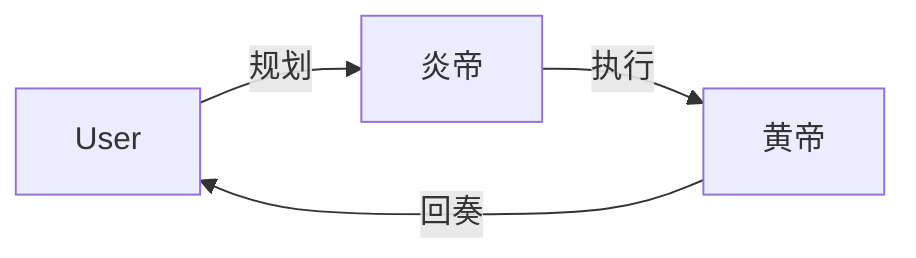
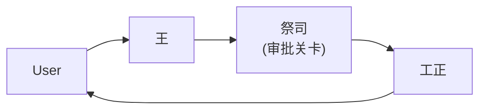
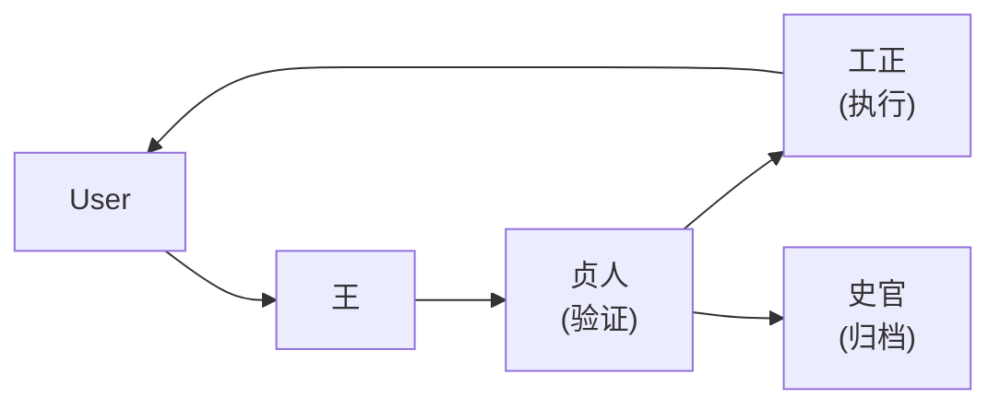
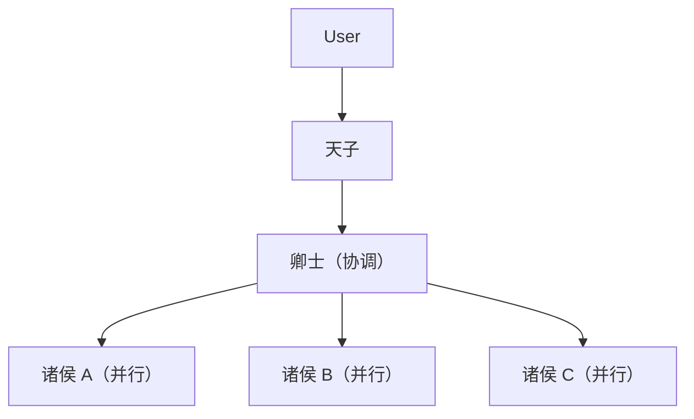
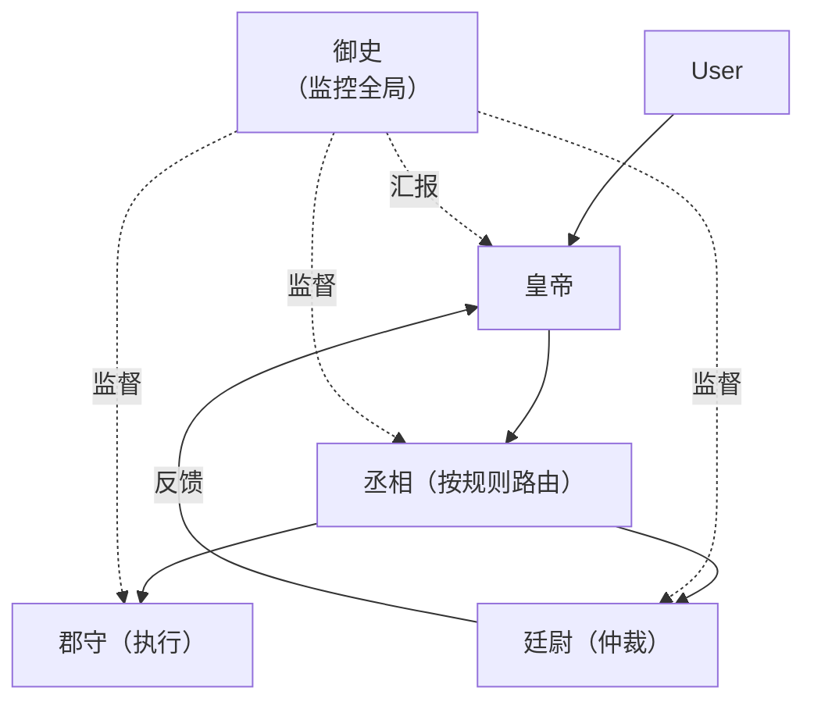
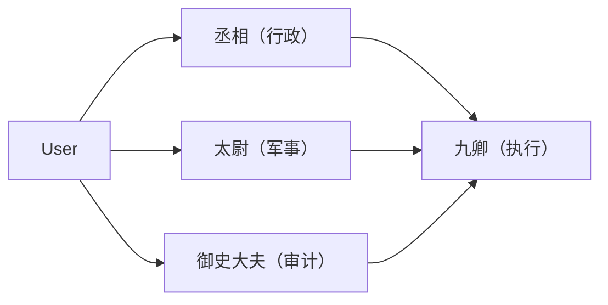
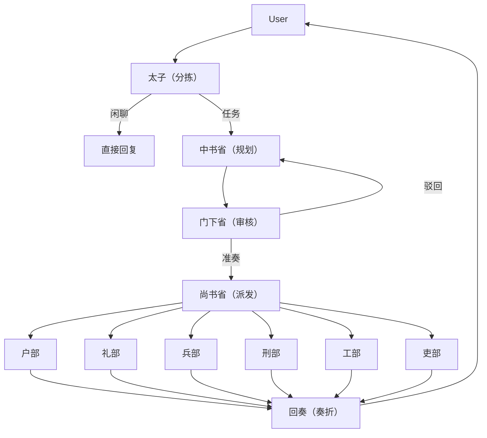
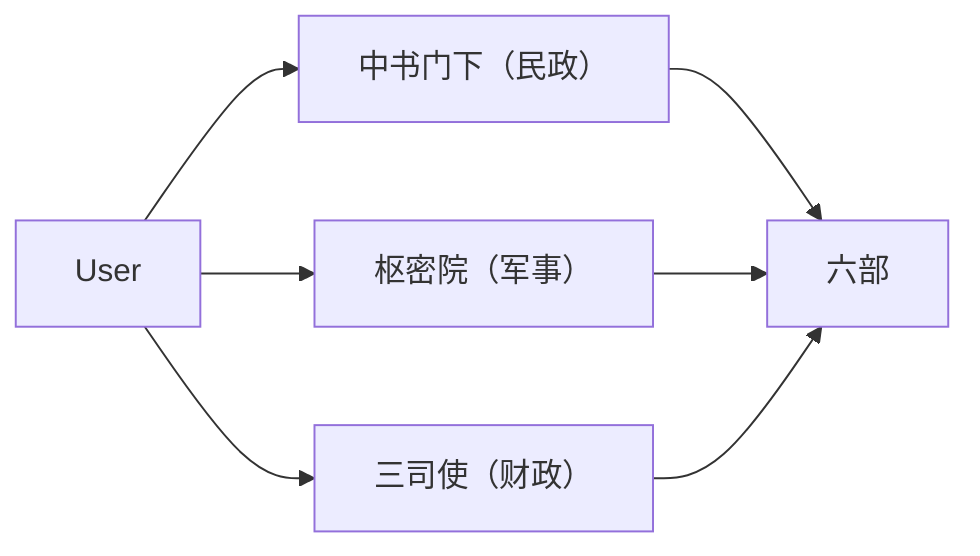
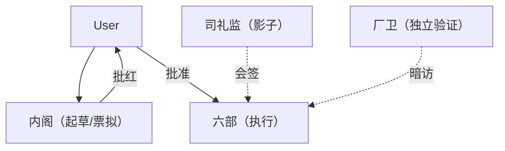
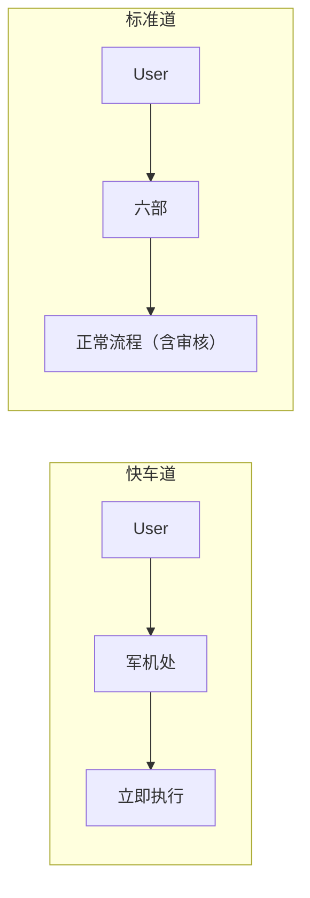

# 历代官制拓扑

十种官制拓扑，按历史演进排列，从最简到最繁，展示多 Agent 协作模式的完整进化脉络。

> 以下各节的"内建循环映射"使用 `Builtin-Loops-内建循环.md` 定义的五大构建块（Automation / Worktree / Skill / Sub-agent / Memory）作为分析框架来描述各朝代的制度特征。

---

## 1. 炎黄 · Yan-Huang Era (c. 2700 BCE)

**Agent 数量：2**

最简单的多 Agent 协作——两位部落首领的联盟，各有明确分工领域。

| 角色  | 职责    | 说明        |
| --- | ----- | --------- |
| 炎帝  | 农耕与规划 | 资源评估、策略制定 |
| 黄帝  | 征伐与执行 | 策略实施、行动协调 |

**拓扑**：对等结构。两个 Agent 直接通信，无层级、无审核层。



**通信**：

| From \ To | 炎帝 | 黄帝 |
|---|---|---|
| 炎帝 | — | ✅ |
| 黄帝 | ✅ | — |

**循环模式**：基础单 Agent 循环。无验证步骤。基于信任的协作。

**内建循环映射**：

- **Automations** → 无（人工触发任务）
- **Worktrees** → 无（单线串行执行）
- **Skills** → 无（无成文规则）
- **Sub-agents** → 无（无审核环节）
- **Memory** → 无（口耳相传）

**适用工程场景**：
- ✅ 个人项目、单人原型验证、PoC 阶段  
  *例：周末用 AI 写个爬虫脚本、生成一份调研报告、验证某个技术方案可行性*
- ✅ 无需协调、无审核要求的单任务  
  *例：一次性数据清洗、Markdown 转 PDF、正则表达式批量替换*
- ❌ 团队协作、需代码评审、合规/安全要求、多模块并行

---

## 2. 夏 · Xia Dynasty (c. 2070–1600 BCE)

**Agent 数量：3**

最早的层级结构出现。占卜（甲骨）作为最早形式的质量保证。

| 角色  | 职责   | 说明              |
| --- | ---- | --------------- |
| 王   | 国王   | 目标设定、最终批准       |
| 祭司  | 占卜官  | 占卜（质量检查）、解读"天意" |
| 工正  | 工程主管 | 执行、建设、实施        |

**拓扑**：线性三层。祭司作为关卡——未经占卜吉兆不得推进。



**通信**：

| From \ To | 王 | 祭司 | 工正 |
|---|---|---|---|
| 王 | — | ✅ | ✅ |
| 祭司 | ✅ | — | ✅ |
| 工正 | ✅ | — | — |

**循环模式**：制定者（王/祭司）→ 检查者（祭司）→ 执行者（工正）。占卜步骤是人类治理史上已知的第一个"审批关卡"。

**内建循环映射**：

- **Automations** → 按需触发（王发起指令）
- **Worktrees** → 无
- **Skills** → 祭司的占卜规则（最早的 QA 标准）
- **Sub-agents** → 祭司作为检查者，执行占卜验证
- **Memory** → 口耳相传（无持久记录）

**适用工程场景**：
- ✅ 引入**首个质量关卡**的轻量流程  
  *例：Git pre-commit hook 跑 Lint/单测；PR 合并前必须 CI 绿灯；发布前自动安全扫描*
- ✅ 单一审批节点即可的场景  
  *例：只有 Tech Lead 审批的小团队；变更单经一人确认即可上线*
- ❌ 需多重审核、并行执行、复杂依赖编排

---

## 3. 商 · Shang Dynasty (c. 1600–1046 BCE)

**Agent 数量：4**

神权政治正式化。贞人从王权中获得独立，形成规划与验证的分离。史官引入永久性记录。

| 角色  | 职责   | 说明        |
| --- | ---- | --------- |
| 王   | 国王   | 战略方向、资源分配 |
| 贞人  | 占卜官  | 独立验证、仪式审批 |
| 史官  | 书记官  | 记录决策、维护档案 |
| 工正  | 工程主管 | 跨项目执行     |

**拓扑**：四节点流水线，带预写日志。



**通信**：

| From \ To | 王 | 贞人 | 史官 | 工正 |
|---|---|---|---|---|
| 王 | — | ✅ | ✅ | ✅ |
| 贞人 | ✅ | — | ✅ | ✅ |
| 史官 | — | ✅ | — | ✅ |
| 工正 | ✅ | — | ✅ | — |

**循环模式**：制定者 → 验证者 → 记录者 → 执行者。史官的甲骨文是已知最早的审计日志——不可篡改、带时间戳的记录。

**核心创新**：验证与执行分离。贞人听命于比国王更高的权威（天意）。

**内建循环映射**：

- **Automations** → 按需触发（贞人按时举行占卜仪式）
- **Worktrees** → 无
- **Skills** → 贞人的占卜规程、史官的记录格式
- **Sub-agents** → 贞人（验证者）+ 史官（记录者），双重子角色
- **Memory** → 甲骨文（冷存储，最早的可持久化审计日志）

**适用工程场景**：
- ✅ 需**审计日志/不可篡改记录**的合规场景  
  *例：金融核心账务变更留痕（谁批、谁改、何时、前后值）；医疗设备固件发布全链路归档；SOX 合规要求的变更记录*
- ✅ 验证与执行分离、且需永久留痕  
  *例：DBA 审核 SQL 变更 → 运维执行 → 自动归档到审计库*
- ❌ 高并发、多团队并行、需快速迭代

---

## 4. 周 · Zhou Dynasty (c. 1046–256 BCE)

**Agent 数量：5+（可扩展）**

封建制度。中央权威向半自治的地方 Agent 授权，在各自封地内并行工作。

| 角色     | 职责   | 说明             |
| ------ | ---- | -------------- |
| 天子     | 天下共主 | 高层远见、诸侯任命、最终仲裁 |
| 诸侯 × N | 地方领主 | 在指定领域内独立执行     |
| 卿士     | 中央大臣 | 政策起草、诸侯间协调     |

**拓扑**：星状群岛。中央枢纽向有一定自治权的并行节点授权。



**通信**：

| From \ To | 天子 | 卿士 | 诸侯 |
|---|---|---|---|
| 天子 | — | ✅ | ✅ |
| 卿士 | ✅ | — | ✅ |
| 诸侯 | ✅ | ✅ | — |

**循环模式**：**Worktree 模式**。各诸侯的封地是一个隔离沙箱。并行执行，无冲突。这是 git worktree 的古代等价物——共享同一底层仓库的独立工作目录。

**内建循环映射**：

- **Automations** → 定期朝贡/汇报（定时任务状态同步）
- **Worktrees** → 按诸侯分封（隔离执行沙箱，互不干扰）
- **Skills** → 诸侯各自治理规则（局部自治）
- **Sub-agents** → 无专职审核（天子依赖诸侯自律）
- **Memory** → 诸侯报告（温存储，定期书面汇报）

**适用工程场景**：
- ✅ **多模块/微服务并行开发**、各模块隔离互不干扰  
  *例：Monorepo 下 `user-service`、`order-service`、`payment-service` 三组并行开发，各自独立分支/Worktree，互不冲突*
- ✅ 单体仓库下多团队并行、共享基础设施但业务解耦  
  *例：前端团队改 UI 库、后端团队改 API、算法团队改模型，同仓库隔离 Worktree*
- ❌ 强一致性事务、跨模块强同步、需集中式审核

---

## 5. 秦 · Qin Dynasty (221–206 BCE)

**Agent 数量：6**

法家集权。一切权力通过确定的、基于规则的体系流转。无自由裁量权，无例外。

| 角色     | 职责   | 说明          |
| ------ | ---- | ----------- |
| 皇帝     | 皇帝   | 唯一决策权、最终签署  |
| 丞相     | 丞相   | 行政执行、政策实施   |
| 御史     | 御史   | 监督、合规监控、审计  |
| 廷尉     | 廷尉   | 规则解释、争议解决   |
| 郡守 × N | 地方长官 | 地方执行、统一规则执行 |

**拓扑**：严格层级，带监控回路。



**通信**：

| From \ To | 皇帝 | 丞相 | 御史 | 廷尉 | 郡守 |
|---|---|---|---|---|---|
| 皇帝 | — | ✅ | ✅ | ✅ | ✅ |
| 丞相 | ✅ | — | — | ✅ | ✅ |
| 御史 | ✅ | ✅ | — | ✅ | ✅ |
| 廷尉 | ✅ | — | ✅ | — | — |
| 郡守 | ✅ | ✅ | ✅ | — | — |

**循环模式**：**确定性流水线**。硬编码工作流，严格的路径规则。御史独立监控每一步——一个只读的观察者，可标记违规。

**核心创新**：统一标准（书同文、车同轨）——所有 Agent 必须使用相同的协议、格式和计量单位。这是 Agent 间通信的协议标准化。

**内建循环映射**：

- **Automations** → 固定奏报计划（各郡县定期上报）
- **Worktrees** → 标准化郡县单元（统一的执行沙箱模板）
- **Skills** → 统一法律（秦律）——所有 Agent 共用同一套规则
- **Sub-agents** → 御史（独立监督者，只读监控）
- **Memory** → 标准化文书（统一格式的持久化记录）

**适用工程场景**：
- ✅ **标准化流水线**、零自由裁量的强制执行  
  *例：Kubernetes 发布流水线：构建→安全扫描→单测→集成测→蓝绿部署→流量切换，每步强制通过才能进入下一步*
- ✅ 所有节点必须遵守统一协议/格式/规范  
  *例：全公司统一 OpenAPI 契约、统一代码规范（强制 clang-format/gofmt）、统一日志格式、统一指标命名*
- ❌ 需人工干预、例外处理、迭代优化、创新探索型任务

---

## 6. 汉 · Han Dynasty (206 BCE – 220 CE)

**Agent 数量：12**

三公共享权力，九卿专注专门领域。第一次成熟的分权体系。

| 层级  | 角色   | 职责   | 说明              |
| --- | ---- | ---- | --------------- |
| 三公  | 丞相   | 丞相   | 行政领导            |
|     | 太尉   | 太尉   | 军事监督            |
|     | 御史大夫 | 御史大夫 | 独立监督，掌管御史台      |
| 九卿  | 九卿   | 九位大臣 | 专门领域（司法、财政、礼仪等） |

**拓扑**：三条并行监督路径汇聚到九条执行轨道。



**通信**：

| From \ To | 皇帝 | 丞相 | 太尉 | 御史大夫 | 九卿 |
|---|---|---|---|---|---|
| 皇帝 | — | ✅ | ✅ | ✅ | ✅ |
| 丞相 | ✅ | — | ✅ | ✅ | ✅ |
| 太尉 | ✅ | ✅ | — | ✅ | ✅ |
| 御史大夫 | ✅ | ✅ | ✅ | — | ✅ |
| 九卿 | ✅ | ✅ | ✅ | ✅ | — |

**循环模式**：**多路验证**。任何决策必须经过三公中至少两位。九卿从多重权威接收指令，形成冗余。

**核心创新**：御史大夫是独立审查者，不参与执行——纯粹的监督，一个专职的验证者 Agent。

**内建循环映射**：

- **Automations** → 每日早朝（固定频率任务汇报）
- **Worktrees** → 无
- **Skills** → 三公/九卿各自的职责规范
- **Sub-agents** → 御史大夫（独立审查，不参与执行）
- **Memory** → 三层记录体系（起居注/计簿/档案）

**适用工程场景**：
- ✅ **多维度并行评审**汇总后再执行  
  *例：新架构方案同时走架构评审组（可扩展性）、安全评审组（威胁建模）、成本评审组（资源估算），三组独立出意见，汇总后由架构师裁决再实施*
- ✅ 三权分立治理：产品/技术/合规三方独立把关  
  *例：数据隐私功能：PM 定需求、Tech Lead 评技术方案、DPO 评合规性，三方同意才能排期*
- ❌ 简单任务、小团队、评审成本过高的场景

---

## 7. 隋唐 · Sui-Tang Dynasties (581–907 CE)

**Agent 数量：12**

三省六部——延续了 1400 年的中国帝国治理成熟形式。

| 层级  | 角色  | 职责   | 说明                 |
| --- | --- | ---- | ------------------ |
| 分拣  | 太子  | 分拣   | 区分闲聊与正式任务          |
| 省   | 中书省 | 规划中枢 | 起草方案、将策略拆解为子任务     |
|     | 门下省 | 审议把关 | 审核方案、封驳权（打回重做）     |
|     | 尚书省 | 调度大脑 | 向各部派发任务、协调执行、汇总回奏  |
| 部   | 户部  | 数据资源 | 数据处理、资源核算          |
|     | 礼部  | 文档规范 | 文档撰写、标准制定、协议管理     |
|     | 兵部  | 工程实现 | 代码开发、工程实施          |
|     | 刑部  | 安全合规 | 安全审计、合规检查、风险评估     |
|     | 工部  | 基础设施 | CI/CD、部署、工具链       |
|     | 吏部  | 人事管理 | Agent 管理、权限维护、配置管理 |

**拓扑**：标准流水线。这是带制度性质量控制的参考架构。



**通信矩阵**：

| From \ To | 太子 | 中书 | 门下 | 尚书 | 六部 |
|---|---|---|---|---|---|
| 太子 | — | ✅ | — | — | — |
| 中书 | ✅ | — | ✅ | ✅ | — |
| 门下 | ✅ | ✅ | — | ✅ | — |
| 尚书 | ✅ | ✅ | ✅ | — | ✅ |
| 六部 | — | — | — | ✅ | — |

**循环模式**：**完整的制定者-检查者闭环，带驳回循环**。规划（中书）和审核（门下）严格分离。审核者拥有完整驳回权——方案退回返工。这是制度化的反馈循环。

**核心创新**：

- **封驳**：审核者可以驳回并阻止执行——不仅仅是标记问题。
- 六个专门化的执行角色替代通用工人。
- 分拣层（太子）将闲聊与正式工作分离。

**内建循环映射**：

- **Automations** → 每日早朝（固定频率任务分流与汇报）
- **Worktrees** → 按部门隔离（六部各自独立工作目录，并行执行）
- **Skills** → 三省/六部各自 SOUL.md（制度性行为准则与输出规范）
- **Sub-agents** → 门下省专职封驳（制定者与检查者严格分离，可驳回）
- **Memory** → 起居注（热）/ 实录（温）/ 国史（冷）三层记忆

**适用工程场景**：
- ✅ **完整代码评审闭环**：规划→评审（可驳回重写）→派发→执行→验证  
  *例：标准 PR 流程：设计文档评审（中书）→ 代码 Review 可驳回重写（门下）→ 指派开发/派发测试环境（尚书）→ 开发实现（六部兵部/工部）→ QA 验证（刑部/工部）→ 合并入主干*
- ✅ 专职 Reviewer 与 Author 严格分离的团队  
  *例：代码所有者不参与 Review；专门的 Code Owner 团队负责把关*
- ✅ 标准化研发流程：需求分拣→设计评审→开发→测试→发布  
  *例：太子分拣闲聊/正式需求 → 中书产出技术方案 → 门下封驳 → 尚书派发到各组 → 六部并行执行 → 回奏归档*
- ❌ 极速迭代、原型探索、单人全栈

---

## 8. 宋 · Song Dynasty (960–1279 CE)

**Agent 数量：14+**

权力被刻意分散，防止任何单一 Agent 积累过多权威。多条并行审核路径。

| 角色   | 职责    | 说明               |
| ---- | ----- | ---------------- |
| 中书门下 | 中书门下省 | 合并的规划与审核         |
| 枢密院  | 枢密院   | 军事策略，独立于民政       |
| 三司使  | 三司使   | 收入、支出、专卖——民政财务三分 |
| 六部   | 六部    | 与唐相同，但权威减弱       |

**拓扑**：碎片化权威，领域重叠。



**通信**：

| From \ To | 皇帝 | 中书门下 | 枢密院 | 三司使 | 六部 |
|---|---|---|---|---|---|
| 皇帝 | — | ✅ | ✅ | ✅ | ✅ |
| 中书门下 | ✅ | — | ✅ | ✅ | ✅ |
| 枢密院 | ✅ | ✅ | — | ✅ | ✅ |
| 三司使 | ✅ | ✅ | ✅ | — | ✅ |
| 六部 | ✅ | ✅ | ✅ | ✅ | — |

**循环模式**：**带冗余的多路验证**。单一决策可能需要多个独立审查者的同意。如果审查者意见不一，任务升级。

**核心创新**：Agent 冗余——关键任务由多个 Agent 独立审查，降低单一审查失败的风险。

**内建循环映射**：

- **Automations** → 每日早朝 + 特别朝会（常规 + 紧急双重触发）
- **Worktrees** → 按分支/部门隔离（枢密院与中书门下互不干扰）
- **Skills** → 精细分工的各机构规范（更细粒度的角色定义）
- **Sub-agents** → 多重并行审核（同一决策多方独立验证）
- **Memory** → 三层记忆体系（起居注/实录/国史）

**适用工程场景**：
- ✅ **高可靠/高风险系统**的多重冗余验证  
  *例：核心交易链路：中书门下（业务逻辑评审）、枢密院（并发/性能压测）、三司使（资金流向/账务一致性），三组独立验证，任一组拒绝即阻断*
- ✅ 关键决策需多方独立同意、意见分歧升级仲裁  
  *例：数据库分库分表方案：DBA 组、架构组、业务组三方评审，分歧升级到 CTO 裁决*
- ❌ 普通业务开发、追求吞吐而非极致可靠、评审成本敏感

---

## 9. 明 · Ming Dynasty (1368–1644 CE)

**Agent 数量：10+**

简化顶层，强大的内阁。票拟制度创建了优化的审批流程。

| 角色  | 职责  | 说明               |
| --- | --- | ---------------- |
| 内阁  | 内阁  | 起草政策回应（票拟）、向皇帝汇报 |
| 六部  | 六部  | 领域执行             |
| 司礼监 | 司礼监 | 宦官机构，次级审批通道、会签   |
| 厂卫  | 厂卫  | 独立情报、影子验证        |

**拓扑**：两条并行的审批轨道——正式通道（内阁→六部）和影子通道（司礼监→厂卫）。



**通信**：

| From \ To | 皇帝 | 内阁 | 司礼监 | 厂卫 | 六部 |
|---|---|---|---|---|---|
| 皇帝 | — | ✅ | ✅ | ✅ | ✅ |
| 内阁 | ✅ | — | — | — | ✅ |
| 司礼监 | ✅ | — | — | ✅ | ✅ |
| 厂卫 | ✅ | — | — | — | ✅ |
| 六部 | ✅ | — | — | — | — |

**循环模式**：**快捷通道 + 隐藏审查**。票拟预先检查工作，减轻用户的认知负担。影子通道在不拖慢主流程的前提下提供安全保障。

**核心创新**：双轨制——标准任务的快速审批路径，搭配用于异常检测的隐藏验证层。

**内建循环映射**：

- **Automations** → 每日早朝（固定频率任务分流）
- **Worktrees** → 按部门隔离（六部各自沙箱）
- **Skills** → 精简版机构规范（关注核心职责）
- **Sub-agents** → 双影子通道（司礼监会签 + 厂卫暗访，双重隐蔽验证）
- **Memory** → 三层记忆体系

**适用工程场景**：
- ✅ **双轨发布**：常规版本走完整评审、热修复/小版本走快速通道  
  *例：月度大版本走完整流程（内阁票拟→皇帝批红→六部执行）；P0 热修复走快速通道（内阁 10 分钟出方案→皇帝批红→直接推生产）*
- ✅ 影子验证层：生产暗流量回放、Canary 自动分析、异常自动拦截  
  *例：新版本发布后，司礼监（影子流量对比）、厂卫（异常指标自动告警/回滚）在不阻塞主流程前提下提供安全兜底*
- ✅ 平衡速度与安全：主流程严谨、异常通道兜底
- ❌ 单一发布节奏、无热修复需求、团队极小

---

## 10. 清 · Qing Dynasty (1644–1912 CE)

**Agent 数量：4 机构 / 10+ 细分角色**

超级集权。军机处绕过整个正式官僚体系进行快速决策。

| 角色  | 职责  | 说明           |
| --- | --- | ------------ |
| 军机处 | 军机处 | 紧急决策，绕过正常流程  |
| 六部  | 六部  | 标准领域执行（户/礼/兵/刑/工/吏 6 部）       |
| 理藩院 | 理藩院 | 非汉民族事务，专门领域  |
| 内务府 | 内务府 | 皇室内部事务，独立于民政 |

> **说明**：按"一级机构"计为 4 个主要节点（军机处、六部、理藩院、内务府）；按"具体执行 Agent"计为 10+（军机处 1 + 六部 6 + 理藩院 1 + 内务府 1 + 用户入口 1）。

**拓扑**：双速——军机处对高优先级任务高速运作；六部对常规任务按标准速度运作。



**通信**：

| From \ To | 皇帝 | 军机处 | 六部 | 理藩院 | 内务府 |
|---|---|---|---|---|---|
| 皇帝 | — | ✅ | ✅ | ✅ | ✅ |
| 军机处 | ✅ | — | ✅ | — | — |
| 六部 | ✅ | — | — | — | — |
| 理藩院 | ✅ | — | — | — | — |
| 内务府 | ✅ | — | — | — | — |

**循环模式**：**双速循环**。两个并发循环——一个最小开销的快速循环（军机处）和一个完整审核的标准循环（六部）。用户根据任务的紧急性和风险选择使用哪个循环。

**核心创新**：任务优先级——并非所有任务都需要相同级别的审核。紧急任务走精简路径，常规任务走完整治理流程。

**内建循环映射**：

- **Automations** → 双重节奏调度（军机处急速响应 + 六部常规节奏）
- **Worktrees** → 按议政处/部门隔离（军机处与六部互不干扰）
- **Skills** → 精简版机构规范
- **Sub-agents** → 军机处覆写（紧急情况下可跳过常规审核链）
- **Memory** → 三层记忆体系

**适用工程场景**：
- ✅ **双速运维**：P0 故障/热修复走军机处极速通道（分钟级），常规需求走标准流程  
  *例：线上严重 Bug：军机处（核心架构师+值班 SRE）5 分钟定方案→直接热补丁推生产；同期常规需求继续走两周迭代流程（六部）*
- ✅ 紧急变更与常规变更**并行互不干扰**、资源隔离  
  *例：军机处占用独立 CI/CD 流水线、独立 Kubernetes namespace、独立数据库连接池，不抢占六部资源*
- ✅ 明确优先级分级、SLA 不同的任务混合调度  
  *例：P0(15min)、P1(2h)、P2(1d)、P3(常规迭代)四级 SLA，不同等级走不同循环*
- ❌ 无紧急通道需求、所有任务同等优先级、团队无值班/应急机制

---

## 演进总结

按顺序阅读这 10 种拓扑，可以清晰看到复杂度的递增模式：

```
2  个 Agent — 扁平协作
3  个 Agent — 首个关卡/检查点
4  个 Agent — 关注点分离、日志记录
5+ 个 Agent — 隔离并行执行
6  个 Agent — 确定性路由、严格协议
12 个 Agent — 独立监督、三权分立
12 个 Agent — 制度性审核、驳回循环
14+个 Agent — 冗余验证、升级机制
10+个 Agent — 双轨制（快速 + 全面）
8+ 个 Agent — 双速循环（基于紧急程度）
```

复杂度并非从 2 严格递增到 14 再回到 8。后期朝代（明、清）实际上**减少**了 Agent 数量，同时引入了更智能的模式（双轨、双速）。**有设计的简洁胜过无设计的复杂。**
