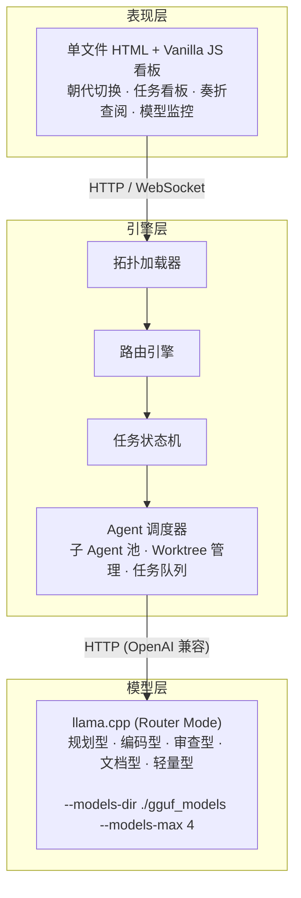
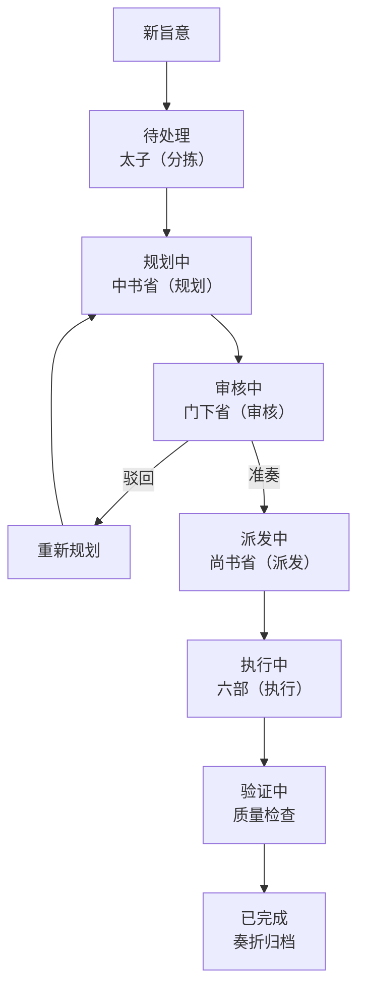
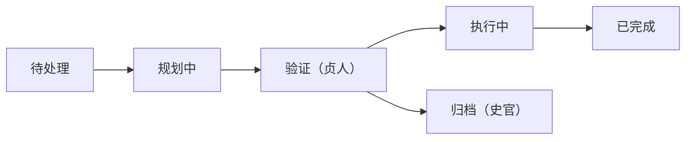
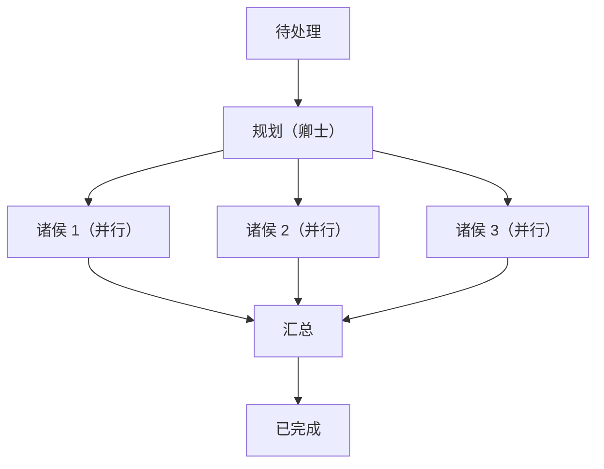
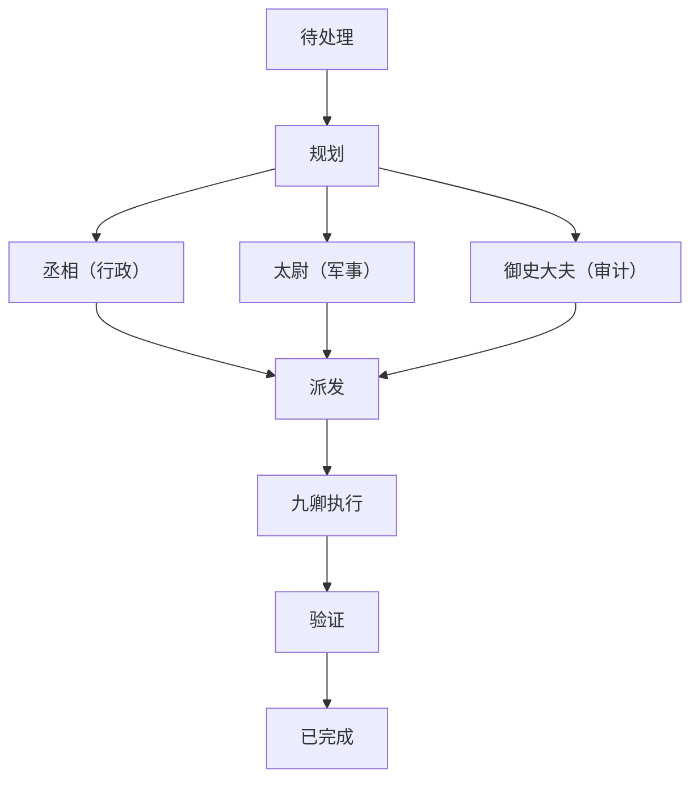
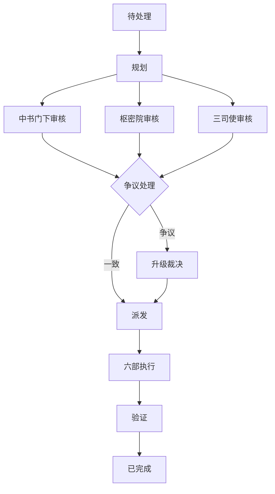
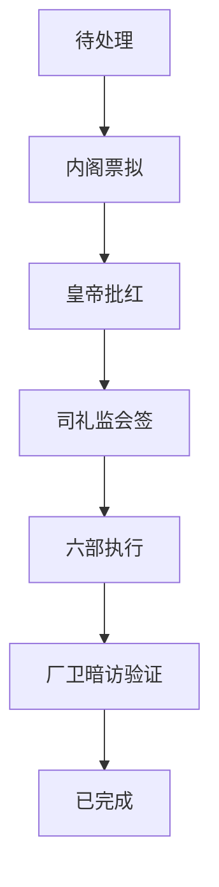

# 架构设计

## 项目定位

ZhenguanEdict 是一个将中国历代治理智慧的演进映射为多智能体协作拓扑的实验性框架。每一个朝代代表一种独特的 Agent 组织方式、通信规则和决策流转模式。

与大多数固定一种协作模式的多智能体框架不同，ZhenguanEdict 支持**运行时动态切换**协作模式——让用户可以观察和比较不同治理模型对任务执行效率、质量和成本的影响。

---

## 三层架构



### 表现层

看板是一个**单文件 HTML**，使用 Vanilla JavaScript 和 CSS。无构建步骤、无包管理器、无框架依赖。通过 HTTP REST 调用与引擎层通信。

核心视图：

- **旨意看板** — 按状态列展示任务，可按朝代和部门筛选
- **朝代切换** — 一键切换治理拓扑
- **奏折阁** — 已完成任务的完整时间线记录
- **官员总览** — Token 消耗、Agent 健康状态、模型状态

### 引擎层

核心 Python 服务，包含四个组件：

**拓扑加载器**：从结构化定义（Python dict 或 YAML）加载朝代的完整配置——Agent 角色、通信矩阵、状态机规则。用户切换朝代时，拓扑加载器热加载新配置，无需重启服务。

**路由引擎**：执行当前朝代的权限矩阵定义的通信规则。决定哪些 Agent 可以和谁通信、允许什么消息类型、消息是否需要审批后才能转发。

**任务状态机**：管理每个任务在 9 个状态间的生命周期流转：

```
新建 → 待处理 → 规划中 → 审核中 → (驳回 → 重新规划 → 审核中)
        → 派发中 → 执行中 → 验证中 → 已完成
```

状态机是朝代感知的：有些朝代跳过审核（炎黄），有些增加多重审核（宋）。

**Agent 调度器**：管理实际执行——将任务分配到模型实例、为并行执行创建 Worktree、管理队列积压、处理重试和失败。

### 模型层

基于 **llama.cpp** 的 Router Mode 运行。这允许在单个 OpenAI 兼容的 API 端点后加载多个 GGUF 模型。路由器根据请求中的 `model` 字段将每个请求分发到相应模型。

---

## 运行时朝代切换

运行时切换朝代是此项目的核心差异化特性。切换流程：

1. 用户从看板选择新朝代
2. 拓扑加载器读取新朝代的定义（`topologies/tang.py`、`topologies/song.py` 等）
3. 通信矩阵更新——将正在飞行中的任务映射到新路由规则
4. Agent 调度器按需创建/移除 Agent 实例
5. 看板刷新以显示新的组织架构
6. 所有历史任务数据（奏折）在切换中保留

系统在切换时会保留所有未完成任务，但新朝代的路由规则将用于后续任务。

---

## 模型类型定义

按能力需求定义五种模型类型，不绑定具体模型名称：

| 模型类型    | 预期能力            | 典型角色        |
| ------- | --------------- | ----------- |
| **规划型** | 强推理、任务拆解、长上下文支持 | 中书省、内阁      |
| **编码型** | 代码生成、调试、技术实现    | 兵部、工部       |
| **审查型** | 批判性分析、安全审计、错误检测 | 门下省、刑部、御史   |
| **文档型** | 结构化写作、文档编写、报告生成 | 礼部、户部（报表）   |
| **轻量型** | 快速响应、分类、路由      | 太子、诸侯（简单任务） |

每个朝代将这些类型映射到具体角色。同一物理模型可为多种类型服务，不同类型也可在资源受限环境下共享同一物理模型。

---

## 任务状态机

唐代为标准参考状态流转，各朝代在此基础上简化或扩展。下文逐一展示。

### 唐代（标准参考）



### 炎黄

二元协作，无审核、无验证。


### 夏

最早的质量关卡——占卜（祭司审批）。


### 商

验证与执行分离，史官独立归档。



### 周

封建并行——各诸侯在独立沙箱中执行。



### 秦

确定性流水线，严格按规则路由，无驳回循环。


### 汉

三公并行校审，九卿领域执行。



### 宋

多重并行审核，争议升级裁决。



### 明

双轨审批——正式票拟 + 影子会签、暗访验证。



### 清

双速——紧急任务走军机处快车道，常规任务走标准审核道。


---

## 权限矩阵模式

每个朝代定义一个有向通信矩阵，指定谁可以向谁发送消息。通用形式：

| From \ To | 决策层 | 规划层 | 审核层 | 执行层 |
| --------- | --- | --- | --- | --- |
| **决策层**   | —   | ✅   | ✅   | ✅   |
| **规划层**   | ✅   | —   | ✅   | ✅   |
| **审核层**   | ✅   | —   | —   | ✅   |
| **执行层**   | —   | —   | ✅   | —   |

具体矩阵按朝代调优——秦执行更严格的规则，周允许诸侯节点之间更多横向通信。

---

## 奏折系统

每个任务产生一份奏折——其生命周期的结构化记录：

- 任务 ID、所属朝代、时间戳
- 完整 Agent 对话记录
- 每次审核的决策及其理由
- 最终输出和产物
- 各步骤 Token 消耗

奏折持久化存储（SQLite 或 Markdown 文件），可在看板中查询。功能与历史朝臣的奏折相同：完整审计线索，不可篡改。

---

## 前端设计原则

一个**单文件 `index.html`**，由 Python 后端直接提供：

- Vanilla JavaScript（ES 模块，无打包工具）
- CSS Grid / Flexbox 布局，无 CSS 框架
- 默认深色模式（灵感来自宫廷审美）
- 内置中英文切换
- 通过 `fetch()` REST 调用与后端通信
- 通过轮询或 SSE 自动刷新看板
- 目标页面总大小：200KB 以下（不含 LLM 响应）
