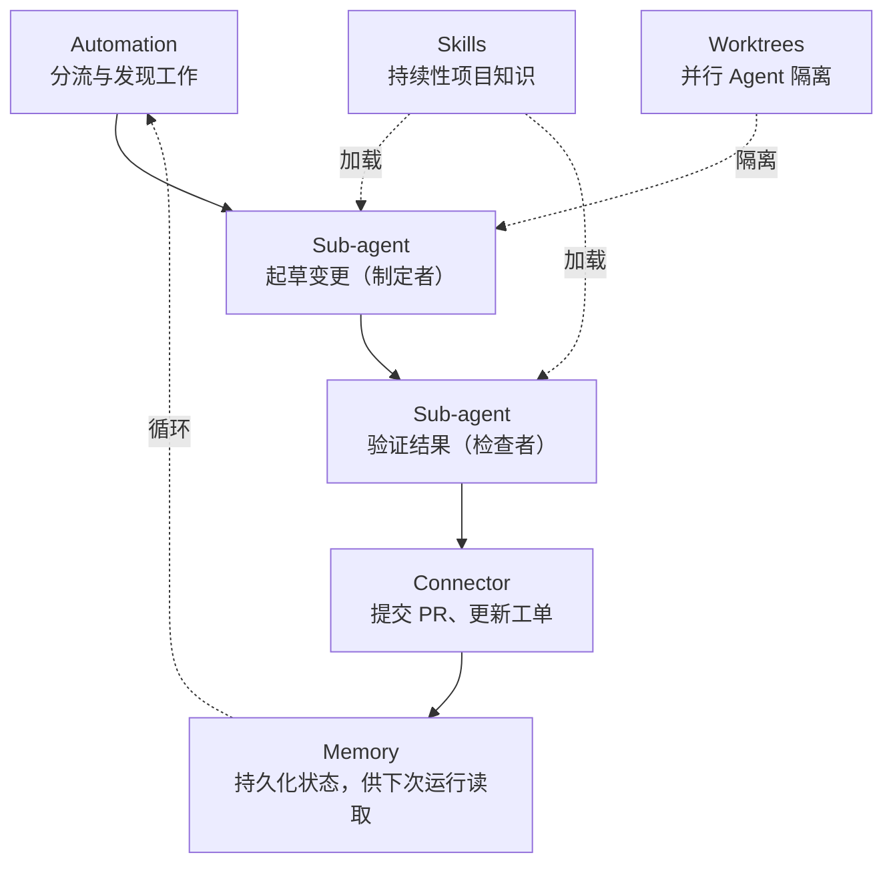

# Loop Engineering

## 什么是 Loop Engineering

Loop Engineering 是用**自动化的系统来按计划驱动 AI Agent**，替代手动键入每条提示词。你不再逐条编写指令，而是设计一个外循环——发现工作、分发任务、验证结果、持久化状态、决定下一步行动。

该术语于 2026 年由 Addy Osmani、Peter Steinberger、Boris Cherny 等人推广，代表 AI 交互的第三层：

| 层级                   | 优化对象                      | 工作单元        |
| -------------------- | ------------------------- | ----------- |
| 提示工程                 | 单条指令的措辞                   | 你手动键入的一次交互  |
| 上下文工程                | Prompt 窗口中的内容（文档、历史、工具定义） | 一次回答的前提条件   |
| **Loop Engineering** | 决定提示什么、何时提示、结果是否可接受的系统    | 跨多次交互的自运行循环 |

---

## 五大构建块

一个可工作的循环需要五个组件，加上持久化记忆：



---

## 与中国治理体系的映射

每个 Loop Engineering 构建块都能在中国传统治理中找到直接对应物。这种映射不仅仅是比喻——古代系统解决的是相同的协调问题。

### 1. Automation ↔ 早朝 / 朝会

**现代含义**：按计划触发的自动化流程，无需人工介入。一个定期执行的提示词在固定节奏下发现新任务并将其加入队列。

**古代对应**：每日早朝。黎明时分，官员们集合汇报各自的工作，提出新问题，听取皇帝的指示。这是一个定期、结构化、有固定仪式的会议。

**实现思路**：轻量级调度器（类似 cron）触发出每个朝代的"早朝"事件。各朝代定义各自的频率——有的每日上朝，有的每周一次。自动化读取当前积压任务，按优先级排序，启动相应的工作流。

---

### 2. Worktree ↔ 分封制 / 郡县制

**现代含义**：Git Worktree 允许多个 Agent 在同一仓库上同时工作而不会产生文件冲突。每个 Agent 在自己的分支上获得一个隔离的工作目录。

**古代对应**：分封制下，每位诸侯拥有独立的领土。诸侯在各自领地内自治运作，工作永不互相干扰。秦朝的郡县制是另一种隔离模型——统一规则下的标准单元，由中央协调。

**实现思路**：当某个朝代的拓扑要求并行执行时（例如多个诸侯或多个部门同时工作），调度器创建隔离的 Worktree——临时目录，各自拥有独立的工作状态。一个 Agent 的故障不会影响其他 Agent。

---

### 3. Skill ↔ 祖制 / 成宪 / 会典

**现代含义**：Skill 是书面化的项目知识——约定、构建步骤、架构决策——Agent 在每次会话开始时加载。Skill 防止 Agent 每次都从零推导项目上下文。

**古代对应**：祖制和会典是制度知识的汇编，定义了政府如何运作。每位新官员都要研读这些文本以了解程序、先例和禁令。

**实现思路**：每个角色（中书省、兵部等）有一个 `SOUL.md` 文件，定义其行为准则、输出格式要求和领域约束。Skill 在 Agent 实例创建时加载，并在每个任务中被引用。

---

### 4. Sub-agent ↔ 封驳 / 审核制度

**现代含义**：Sub-agent 将制定者和检查者分离。写代码的 Agent 不应是给代码打分的那一个。一个独立的验证者 Agent 使用不同的指令（有时是不同的模型）来捕捉第一个 Agent 自我说服的错误。

**古代对应**：唐代的封驳制度赋予门下省拒绝和退回任何被认为不合适的皇帝诏令的权力。规划者（中书省）和审查者（门下省）严格分离——审查者不能同时也是规划者。这是最早的制定者-检查者分离。

**实现思路**：当某朝代拓扑包含审核角色（门下省、御史大夫、司礼监）时，调度器生成一个独立的 Sub-agent 实例用于验证。审查者接收制定者的输出，对照其 Skill 中定义的质量标准进行评估。如被驳回，任务连同反馈一起返回给制定者。

---

### 5. Memory ↔ 起居注 / 实录 / 国史

**现代含义**：跨运行持久化的状态。模型会在会话间遗忘一切，因此记忆必须存在磁盘上——以 Markdown 文件、数据库或工单看板的形式。

**古代对应**：起居注记录皇帝的每项行动和诏令。实录将这些编纂为正史。国史是永久档案。这三层对应现代系统的热/温/冷记忆。

**实现思路**：

| 层级  | 名称  | 存储方式            | 内容          |
| --- | --- | --------------- | ----------- |
| 热   | 起居注 | 内存 / SQLite     | 活跃任务状态、当前会话 |
| 温   | 实录  | Markdown / JSON | 已完成奏折、近期历史  |
| 冷   | 国史  | 平面文件 / 数据库      | 历史数据、长期模式   |

---

## 在 llama.cpp 上的实现策略

### 基础层：Router Mode

llama.cpp 的 Router Mode 提供多模型服务底座：

```
llama-server --models-dir ./gguf_models --models-max 4 -c 8192 -ngl 99
```

这将启动一个 OpenAI 兼容的 API，每个模型通过文件名寻址。路由引擎根据任务类型和当前朝代角色分配选择调用哪个模型。

### 循环调度器

轻量级 Python 调度器管理执行循环：

- **定时驱动**：朝代定义的节奏（早朝频率）
- **事件驱动**：用户提交的任务触发立即执行
- **状态驱动**：一个任务的完成触发依赖任务（尚书省向多部门派发）

### Worktree 管理

针对并行执行模式（周、唐六部、宋）：

```python
# 思路：每个并行 Agent 获得一个隔离工作空间
import tempfile

class WorktreeManager:
    def create_worktree(self, agent_id, base_branch="main"):
        path = tempfile.mkdtemp(prefix=f"worktree_{agent_id}_")
        return path

    def destroy_worktree(self, path):
        pass
```

### Skill 加载

每个 Agent 在实例化时加载其 Skill 定义：

```python
# 思路：Skill 定义 Agent 行为
class AgentSkill:
    def __init__(self, role_name):
        self.soul = load_markdown(f"skills/{role_name}/SOUL.md")
        self.rules = load_yaml(f"skills/{role_name}/rules.yaml")
```

### 记忆层

```python
# 思路：三层记忆
class Memory:
    def __init__(self):
        self.hot = SQLiteMemory()    # 活跃状态
        self.warm = FileMemory()     # 已完成任务
        self.cold = ArchiveFile()    # 历史模式
```

---

## 各朝代的循环模式

每种朝代拓扑对应一个特定的循环配置：

| 朝代  | Automation | Worktree | Skill | Sub-agent | Memory |
| --- | ---------- | -------- | ----- | --------- | ------ |
| 炎黄  | 无          | 无        | 最小    | 无         | 无      |
| 夏   | 按需         | 无        | 基于角色  | 祭司作为检查者   | 口头传递   |
| 商   | 按需         | 无        | 基于角色  | 贞人 + 史官   | 甲骨（冷）  |
| 周   | 定期         | 按诸侯      | 按诸侯层级 | 无         | 报告（温）  |
| 秦   | 固定计划       | 标准化      | 统一    | 御史（监控）    | 标准化记录  |
| 汉   | 每日早朝       | 无        | 公/卿级  | 御史大夫（独立）  | 三层     |
| 唐   | 每日早朝       | 按部门      | 省/部级  | 门下省（专职）   | 三层     |
| 宋   | 每日 + 特别    | 按分支      | 精细    | 多重并行      | 三层     |
| 明   | 每日早朝       | 按部门      | 精简    | 双影子通道     | 三层     |
| 清   | 双轨（紧急+常规）  | 按议政处     | 精简    | 军机处覆写     | 三层     |

---

## 成本考量

Loop Engineering 既放大生产力也放大 Token 消耗。关键原则：

- **并非所有任务都需要完整循环**：常规任务使用标准循环，紧急任务可跳过审核（清双速）。
- **检查者模型可以更便宜**：验证子 Agent 可以使用比制定者更小/更快的模型。
- **记忆减少重复查询成本**：良好结构的 Skill 意味着无需在每次交互中重复同样的上下文。
- **警惕空闲循环**：一个每小时运行但什么也没找到的自动化，仍然在分流步骤上消耗 Token。
